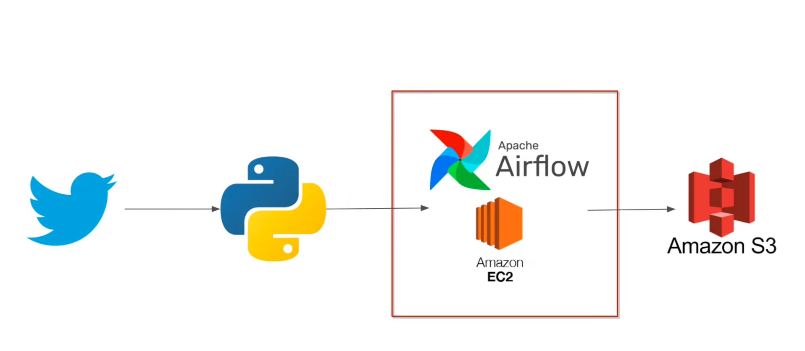

# twitter-airflow-data-engineering-project

# Project Goals
 extract data using Twitter API
 use python to transform data 
 deploy the code on Airflow/EC2 and save the final result on Amazon S3 

# Resources 

Twitter API - https://developer.twitter.com/en/docs/twitter-api
